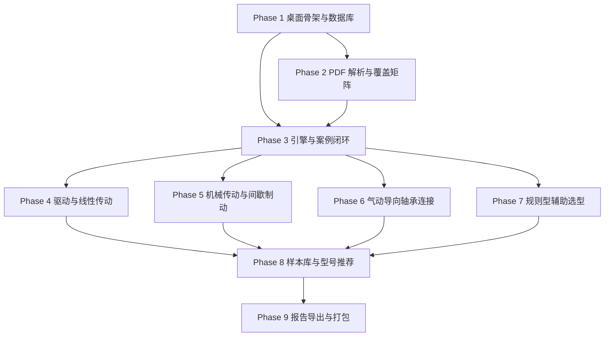

# Development Plan — 非标自动化选型计算工具

> 本文件记录项目的开发阶段划分、当前进度和剩余工作。
> 新 session 启动时应首先阅读 `Product-Spec.md`、`Design-Brief.md` 和本文件，优先执行 `Product-Spec.md` 的 2026-07-08 用户测试修正。

---

## 2026-07-08 方向纠偏

用户测试后确认：第一版不是给人看 PDF 覆盖和知识追溯的工具，而是给机械设计师日常快速选型计算的中文离线计算器。旧 Phase 中的 PDF 覆盖矩阵、QA 覆盖检查、知识检索、内部参数库、独立报告导出页全部从用户可见范围移除。

当前优先级：

1. 主界面只保留“选型计算”入口。
2. 计算完成后在结果页直接导出 PDF 或 Excel 报告。
3. 前端所有可见文案中文化，删除无必要英文、Phase、QA、PDF、知识库、覆盖矩阵、内部参数库等开发用语。
4. 计算结果只显示公式、代入值、中间值、结论和风险，不显示来源页码或任何 PDF 相关痕迹。
5. 后续公式重构必须按“设计师实际已知参数”组织输入项，并用公开工程公式和厂家技术资料复判，不再照搬 PDF 目录。
6. UI 由开发方直接负责设计和实现；不再等待用户设计稿，当前按工程计算工作台方向推进。

## 2026-07-09 当前开发进度

Phase 10 的界面去 PDF 化和工程计算工作台 UI 已完成并推送到远端，当前最新 UI 提交为 `c52d506`。

本轮继续推进公式重构，已改完并通过后端回归测试的模块：

- `servo-stepper-sizing`：增加外部阻力、垂直负载系数，扭矩公式覆盖摩擦力、加速力、垂直负载力和外部阻力。
- `ball-screw-servo`：增加外部轴向力、垂直负载系数、支撑跨距、底径、支撑方式系数、额定动载荷和目标行走寿命；输出临界转速、估算行走寿命和对应风险。
- `pneumatic-cylinder-sizing`：增加外部阻力、垂直负载系数、有效面积系数；缸径反算覆盖负载率、效率和回程面积差。
- `vacuum-suction-sizing`：增加姿态修正系数；吸附力计算覆盖搬运姿态和有效吸附率。
- `linear-guide-sizing`：增加目标行走寿命；按 `50 * (C / P)^3` 估算额定寿命并输出寿命风险。
- `timing-belt-basic`：增加外部阻力、垂直负载系数；等效推力覆盖摩擦力、加速力、垂直负载力和外部阻力。
- `general-motor-power`：增加启动加速时间、外部阻力、垂直负载系数；输出等效推力、功率、扭矩、转速和调速范围风险。
- `pneumatic-flow-control`：增加气缸数量、杆径、管路内径、管路长度、阀额定流量；输出峰值流量、持续耗气量和阀流量余量。
- `cam-indexer-sizing`：增加分割时间、运动曲线系数；输出停歇时间、角加速度、设计扭矩和峰值功率。
- `rolling-bearing-life`：增加 X/Y 载荷系数、目标寿命、C/C0 和寿命指数；输出 L10 寿命、所需动额定载荷和静载余量。
- `linear-bearing-selector`：增加轴承数量、方向系数、冲击系数和目标行走寿命；输出 50 km 基准寿命、所需 C 值和速度风险。
- `coupling-selector`：增加峰值扭矩、候选额定扭矩、温度修正和角向/轴向偏差；输出扭矩余量、扭转需求指标和偏差指标。
- `v-belt-selector`：增加包角修正系数、带长修正系数、皮带根数和候选单根额定功率；输出单根需求功率、修正额定功率、功率余量和有效拉力。
- `chain-selector`：增加传递功率、工况系数、链排数和候选单排额定功率；输出设计功率、单排需求功率、功率余量和链条有效拉力。
- `gear-basic`：增加传递扭矩、主动齿轮转速、工况系数和许用齿根应力；输出齿面切向力、弯曲应力指标、齿根应力余量和节线速度。
- `reducer-basic`：增加工况系数、候选额定输出扭矩、输出轴径向/轴向载荷和允许输入转速；输出输入扭矩、输出功率、扭矩余量、轴载余量和输入转速余量。
- `linear-module-selector`：增加外部阻力、垂直负载系数、驱动效率、候选额定推力、导向载荷系数、动/静额定载荷、目标行走寿命和候选重复定位精度；输出推力余量、导向设计载荷、额定寿命、所需动额定载荷、静载余量和精度余量。
- `pneumatic-gripper-sizing`：增加姿态重力系数、外部扰动力、候选单爪夹持力和候选允许手指力矩；输出单爪夹持力、夹持力矩和候选余量。
- `pneumatic-slide-table-sizing`：增加外部阻力、垂直负载系数、候选额定推力、负载偏心距、候选允许力矩和候选允许动能；输出推力、偏载力矩和动能余量。
- `pneumatic-rotary-actuator-sizing`：新增旋转气缸选型计算；按负载惯量、旋转角度、动作时间、候选扭矩和允许动能输出需求扭矩、动能余量和最小旋转时间。
- `robot-rule-selector` / `cable-chain-rule-selector` / `sensor-rule-selector` / `material-rule-selector` / `machining-rule-selector` / `heat-surface-rule-selector` / `hardware-rule-selector`：规则型模块统一去 PDF 来源，前端结果样例补齐，不再回退到默认同步带结果。
- 删除无路由引用的旧模块介绍页，避免 PDF 来源说明被误接回用户界面。

已验证：`cargo test` 15 项通过；`pnpm run typecheck` 通过；`pnpm run test` 7 个测试文件、22 项测试通过；`pnpm run build` 通过；`git diff --check` 通过。

## 2026-07-09 UI 设计接管

用户确认不再自行设计 UI。下一步开发目标：

- 将临时界面升级为可长期使用的工程计算工作台。
- 保持“选型计算”单入口，不恢复旧 PDF/QA/知识库/内部参数库入口。
- 桌面主布局改为左侧计算对象列表、中间参数输入、右侧结果与风险。
- 优化表单、状态条、结果摘要、公式步骤、风险提示和报告导出区域的视觉层级。
- 所有可见文案继续保持中文，不展示 PDF 来源痕迹。

## Phase 10: 去 PDF 化与用户测试问题修复

**交付内容**：
- 删除用户可见导航中的 PDF 覆盖矩阵、QA 覆盖检查、知识检索、内部参数库、独立报告导出和厂家样本库入口。
- 保留选型计算主流程：模块搜索 -> 参数输入 -> 计算 -> 结果过程 -> 当前结果导出报告。
- 报告导出嵌入计算结果页，支持 PDF 和 Excel。
- 计算结果和报告内容删除来源页码、资料名、PDF 相关字段。
- 自动测试改为验证新产品边界，防止旧页面入口回归。
- 新增 UI 设计交接文档，告诉用户如何提供自定义界面设计稿。
- 新增公式调研记录文档，后续按产品目录逐项重构参数输入和公式。

**关键文件**：
- `selector-desktop/src/app/routes.tsx`
- `selector-desktop/src/app/App.tsx`
- `selector-desktop/src/shared/ui/AppShell.tsx`
- `selector-desktop/src/features/calculation/CalculationPage.tsx`
- `selector-desktop/src/features/calculation/CalculationResultPanel.tsx`
- `selector-desktop/src/features/reports/ReportExportDialog.tsx`
- `selector-desktop/src-tauri/src/report/content.rs`
- `selector-desktop/src/app/*.test.tsx`
- `UI-DESIGN-HANDOFF.md`
- `FORMULA-RESEARCH.md`

**验收标准**：
- 应用首屏只能看到“选型计算”主入口。
- 页面上不出现 PDF 覆盖矩阵、QA 覆盖检查、知识检索、内部参数库、独立报告导出入口。
- 完成一次计算后，结果页能直接导出 PDF 或 Excel 报告。
- 结果页和报告模板不展示 PDF 页码或资料来源痕迹。
- `pnpm typecheck`、`pnpm test`、Rust 测试和构建验证通过。

---

## 规划结论

第一版以 `Product-Spec.md` 为准：覆盖既定选型目录中的产品类型，但用户可见产品不暴露 PDF 来源。实现方式分三类：

- 有公式、例题、参数计算的内容做成计算向导。
- 只有类型选择、适用场景、经验规则的内容做成规则选型向导。
- 纯说明、图例、定义类内容只作为内部开发参考，不进入第一版主界面。

代码目录统一使用 `selector-desktop/`，避免中文路径影响 Node、Rust、Tauri、打包工具。

已有 `Design-Brief.md`，且用户已确认 UI 由开发方直接负责。当前以 `Design-Brief.md` 顶部 2026-07-09 设计接管说明为 UI 事实来源。

---

## Phase 1: 桌面骨架与本地数据底座

**交付内容**：
- 搭建 Tauri 2 + React + Vite + TypeScript 桌面项目，应用可在 Windows 本地启动。
- 配置 SQLite 数据库、迁移系统、Tauri SQL/FS 权限和应用数据目录。
- 创建主界面骨架，包含章节导航区、工作区、结果区和全局错误提示。
- 落地 `Design-Brief.md` 中的基础视觉 token、AppShell 三栏工作台、TracePanel 追溯区和 RiskBadge 状态标识。
- 建立核心数据库表，支持后续 PDF 知识、模块、案例、样本库和报告数据落库。

**关键文件**：
- `selector-desktop/package.json` — 前端脚本、依赖和包管理配置。
- `selector-desktop/src-tauri/Cargo.toml` — Rust 依赖、Tauri 插件和构建配置。
- `selector-desktop/src-tauri/src/main.rs` — Tauri 启动入口和插件注册。
- `selector-desktop/src-tauri/src/db/mod.rs` — SQLite 连接、迁移执行和事务工具。
- `selector-desktop/src-tauri/migrations/0001_init.sql` — 初始数据库表结构。
- `selector-desktop/src/main.tsx` — React 应用入口。
- `selector-desktop/src/app/App.tsx` — 主布局和路由容器。
- `selector-desktop/src/app/routes.tsx` — 页面路由。
- `selector-desktop/src/shared/styles/tokens.css` — `Design-Brief.md` 视觉 token 的 CSS 变量落地。
- `selector-desktop/src/shared/ui/AppShell.tsx` — 桌面工具三栏工作台主框架。
- `selector-desktop/src/shared/ui/TracePanel.tsx` — 公式、风险、来源页码追溯面板。
- `selector-desktop/src/shared/ui/RiskBadge.tsx` — 风险、警告、成功、错误状态徽标。

**验收标准**：
- `pnpm install`、`pnpm tauri dev` 能启动桌面应用。
- 首屏按 `Design-Brief.md` 展示 23 章覆盖入口的左侧导航、空工作区、右侧追溯区和数据库健康状态。
- 首次启动自动创建 SQLite 数据库和初始表，重复启动不报错。

---

## Phase 2: 根目录 PDF 解析与覆盖矩阵

**交付内容**：
- 导入根目录 `非标笔记 2025-6-20 18396 1(1).pdf`，抽取页码、目录、正文文本和知识条目。
- 建立 PDF 23 章覆盖矩阵，记录每章实现形态：计算向导、规则选型向导、知识引用。
- 实现知识检索页面，支持按关键词检索 PDF 内容并显示来源页码。
- 实现内部参数候选抽取入口，把摩擦系数、效率、负载率、重力加速度等候选值放入待确认列表。

**关键文件**：
- `selector-desktop/src-tauri/src/pdf/mod.rs` — PDF 抽取模块入口。
- `selector-desktop/src-tauri/src/pdf/text_extract.rs` — 文本型 PDF 页码和正文抽取。
- `selector-desktop/src-tauri/src/pdf/root_note_ingest.rs` — 根目录 PDF 目录和章节解析。
- `selector-desktop/src-tauri/src/knowledge/repository.rs` — 知识条目和来源页码持久化。
- `selector-desktop/src-tauri/resources/pdf_coverage_matrix.json` — 23 章覆盖矩阵种子数据。
- `selector-desktop/src/domain/coverage.ts` — 覆盖矩阵类型定义。
- `selector-desktop/src/features/coverage/CoverageMatrixPage.tsx` — PDF 覆盖矩阵页面。
- `selector-desktop/src/features/knowledge/KnowledgeSearchPage.tsx` — PDF 知识检索页面。
- `selector-desktop/src/features/parameters/ParameterCandidatePage.tsx` — 内部参数候选确认页面。

**验收标准**：
- 应用能读取根目录 PDF 并生成 23 章覆盖矩阵。
- 搜索“惯量比”“摩擦系数”“负载率”能返回对应页码和片段。
- 内部参数候选列表能展示候选值、来源页码、适用场景，用户可确认入库或忽略。

---

## Phase 3: 计算/规则引擎与案例闭环

**交付内容**：
- 实现单位系统、公式步骤模型、规则选型模型、风险提示模型和安全系数手动确认机制。
- 实现通用计算表单渲染器，能根据模块定义生成输入表单、校验字段和单位。
- 实现计算结果面板，展示公式、代入值、中间值、结论、风险和来源页码。
- 实现案例库基础能力：保存、复制、重新计算、删除、搜索。

**关键文件**：
- `selector-desktop/src-tauri/src/engine/mod.rs` — 计算/规则引擎入口。
- `selector-desktop/src-tauri/src/engine/units.rs` — 单位换算。
- `selector-desktop/src-tauri/src/engine/formula.rs` — 公式步骤和过程输出。
- `selector-desktop/src-tauri/src/engine/rules.rs` — 规则选型输出。
- `selector-desktop/src-tauri/src/engine/safety_factor.rs` — 安全系数手动输入和风险校验。
- `selector-desktop/src-tauri/src/cases/repository.rs` — 案例、运行记录、结果快照持久化。
- `selector-desktop/src/domain/calculation.ts` — 计算模块、字段、结果、风险类型。
- `selector-desktop/src/features/calculation/ModuleListPage.tsx` — 模块列表。
- `selector-desktop/src/features/calculation/CalculationFormPage.tsx` — 通用计算表单。
- `selector-desktop/src/features/calculation/CalculationResultPanel.tsx` — 结果展示。
- `selector-desktop/src/features/cases/CaseLibraryPage.tsx` — 案例库页面。

**验收标准**：
- 未输入或未确认安全系数时，计算按钮阻止执行并定位字段。
- 任一演示模块能完成输入、计算、保存案例、复制案例、重新计算、删除案例。
- 结果面板显示过程分析，不只显示最终数值。

---

## Phase 4: 驱动与线性传动章节包

**交付内容**：
- 实现 PDF 章节：电机篇、丝杆篇、同步带、减速机、直线模组。
- 创建电机相关计算向导：通用电机功率、伺服/步进转速、力矩、惯量比、分辨率、安全系数确认。
- 创建丝杆/同步带/减速机/直线模组计算与规则选型向导，输出来源页码和风险提示。
- 将 PDF 例题转为回归样例，覆盖同步带模组、丝杆伺服、通用电机输送线。

**关键文件**：
- `selector-desktop/src-tauri/src/modules/drive/motor.rs` — 电机篇计算和规则。
- `selector-desktop/src-tauri/src/modules/drive/servo_stepper.rs` — 伺服/步进专用计算。
- `selector-desktop/src-tauri/src/modules/transmission/ball_screw.rs` — 丝杆计算和规则。
- `selector-desktop/src-tauri/src/modules/transmission/timing_belt.rs` — 同步带计算和规则。
- `selector-desktop/src-tauri/src/modules/transmission/reducer.rs` — 减速机计算和规则。
- `selector-desktop/src-tauri/src/modules/transmission/linear_module.rs` — 直线模组选型。
- `selector-desktop/src-tauri/src/modules/fixtures/drive_cases.json` — PDF 例题回归样例。
- `selector-desktop/src/features/modules/DriveModulePage.tsx` — 驱动与线性传动章节页面。

**验收标准**：
- 电机篇、丝杆篇、同步带、减速机、直线模组在覆盖矩阵中显示为已实现。
- 同步带例题能输出摩擦力、加速力、输出扭矩和需求转速。
- 丝杆伺服例题能输出直动惯量、角加速度、加速力矩、匀速力矩、总力矩和需求转速。
- 每个结果都包含 PDF 来源页码和安全系数输入记录。

---

## Phase 5: 机械传动与间歇/制动章节包

**交付内容**：
- 实现 PDF 章节：V 带、齿轮、链条、凸轮分割器、制动器/离合器。
- 创建 V 带、链条、齿轮的参数计算和类型判断向导。
- 创建凸轮分割器的工位数、节拍、转速、扭矩/惯量、驱动选择向导。
- 创建制动器/离合器规则选型向导，输出类型建议、关键参数和风险提示。

**关键文件**：
- `selector-desktop/src-tauri/src/modules/transmission/v_belt.rs` — V 带选型。
- `selector-desktop/src-tauri/src/modules/transmission/gear.rs` — 齿轮参数和选型。
- `selector-desktop/src-tauri/src/modules/transmission/chain.rs` — 链条选型。
- `selector-desktop/src-tauri/src/modules/intermittent/cam_indexer.rs` — 凸轮分割器选型。
- `selector-desktop/src-tauri/src/modules/intermittent/brake_clutch.rs` — 制动器/离合器选型。
- `selector-desktop/src-tauri/src/modules/fixtures/mechanical_transmission_cases.json` — 机械传动回归样例。
- `selector-desktop/src/features/modules/MechanicalTransmissionPage.tsx` — 机械传动章节页面。

**验收标准**：
- V 带、齿轮、链条、凸轮分割器、制动器/离合器在覆盖矩阵中显示为已实现。
- 齿轮模块能计算模数/齿数/中心距/减速比相关结果。
- 链条模块能根据节距、齿数、中心距和速度输出选型判断。
- 凸轮分割器模块能输出驱动需求和风险提示。

---

## Phase 6: 气动、导向、轴承与连接章节包

**交付内容**：
- 实现 PDF 章节：气动执行元件、气动控制（调速阀）、直线导轨、直线轴承、滚动轴承、联轴器。
- 创建气缸、手指气缸、滑台气缸、旋转气缸、真空吸附的计算和规则选型向导。
- 创建导轨、直线轴承、滚动轴承、联轴器的负载/速度/寿命/类型判断向导。
- 将气缸和真空吸附例题转为回归样例。

**关键文件**：
- `selector-desktop/src-tauri/src/modules/pneumatic/cylinder.rs` — 气缸计算。
- `selector-desktop/src-tauri/src/modules/pneumatic/gripper.rs` — 手指气缸和夹持力计算。
- `selector-desktop/src-tauri/src/modules/pneumatic/slide_table.rs` — 滑台气缸推力、偏载力矩和动能计算。
- `selector-desktop/src-tauri/src/modules/pneumatic/rotary.rs` — 旋转气缸扭矩和动能计算。
- `selector-desktop/src-tauri/src/modules/pneumatic/vacuum.rs` — 真空吸附计算。
- `selector-desktop/src-tauri/src/modules/pneumatic/flow_control.rs` — 气动控制与调速阀规则。
- `selector-desktop/src-tauri/src/modules/support/linear_guide.rs` — 直线导轨选型。
- `selector-desktop/src-tauri/src/modules/support/linear_bearing.rs` — 直线轴承选型。
- `selector-desktop/src-tauri/src/modules/support/rolling_bearing.rs` — 滚动轴承选型。
- `selector-desktop/src-tauri/src/modules/support/coupling.rs` — 联轴器选型。
- `selector-desktop/src-tauri/src/modules/fixtures/pneumatic_support_cases.json` — 气动和支撑回归样例。
- `selector-desktop/src/features/modules/PneumaticSupportPage.tsx` — 气动与支撑章节页面。

**验收标准**：
- 气动执行元件、气动控制、直线导轨、直线轴承、滚动轴承、联轴器在覆盖矩阵中显示为已实现。
- 气缸例题能输出摩擦力、加速力、负载率修正、选型输出力。
- 真空吸附例题能输出吸附力、吸盘面积/直径需求和安全系数记录。
- 滚动轴承模块能根据载荷、转速和系数输出样册参数匹配需求。

---

## Phase 7: 规则型辅助选型章节包

**交付内容**：
- 实现 PDF 章节：机器人、拖链、传感器、材料、机加工、热处理&表面处理、常用五金件。
- 创建规则选型向导，按工况问题逐步输出推荐类型、判断依据、注意事项和来源页码。
- 将这些章节纳入统一搜索、案例保存和报告导出结构。

**关键文件**：
- `selector-desktop/src-tauri/src/modules/rules/robot.rs` — 机器人规则选型。
- `selector-desktop/src-tauri/src/modules/rules/cable_chain.rs` — 拖链规则选型。
- `selector-desktop/src-tauri/src/modules/rules/sensor.rs` — 传感器规则选型。
- `selector-desktop/src-tauri/src/modules/rules/material.rs` — 材料规则选型。
- `selector-desktop/src-tauri/src/modules/rules/machining.rs` — 机加工规则选型。
- `selector-desktop/src-tauri/src/modules/rules/heat_surface.rs` — 热处理与表面处理规则选型。
- `selector-desktop/src-tauri/src/modules/rules/hardware.rs` — 常用五金件规则选型。
- `selector-desktop/src-tauri/src/modules/fixtures/rule_modules_cases.json` — 规则选型回归样例。
- `selector-desktop/src/features/modules/RuleModulePage.tsx` — 规则型章节通用页面。

**验收标准**：
- 机器人、拖链、传感器、材料、机加工、热处理&表面处理、常用五金件在覆盖矩阵中显示为已实现。
- 每个规则型章节能通过 3 个以上工况问题输出推荐类型、判断依据、风险提示和来源页码。
- 规则选型结果可保存为案例并可导出报告。

**当前状态**：
- 后端 7 个规则型模块已接入统一计算引擎和回归 fixtures。
- 前端选型计算页已覆盖 7 个规则型模块的计算结果展示，不再展示 PDF 来源痕迹。
- 当前测试覆盖 7 个规则型入口的搜索、选择、安全系数确认、计算结果和模块 id 调用。

---

## Phase 8: 厂家样本库导入与型号推荐

**交付内容**：
- 实现厂家 PDF 样本导入：文本/表格抽取、来源页码、抽取置信度、字段映射、人工确认。
- 实现 Excel/CSV 辅助导入：表头读取、字段映射、单位归一、失败行报告。
- 实现型号推荐：按计算需求参数、样本库字段、启用状态和用户过滤条件筛选候选型号。
- 实现样本库版本管理：导入记录、禁用、删除、重复型号处理。

**关键文件**：
- `selector-desktop/src-tauri/src/vendor/import_job.rs` — 样本导入任务。
- `selector-desktop/src-tauri/src/vendor/pdf_import.rs` — PDF 样本文本/表格抽取和预览。
- `selector-desktop/src-tauri/src/vendor/spreadsheet_import.rs` — Excel/CSV 导入。
- `selector-desktop/src-tauri/src/vendor/field_mapping.rs` — 字段映射和单位归一。
- `selector-desktop/src-tauri/src/vendor/recommendation.rs` — 型号筛选和未匹配原因。
- `selector-desktop/src/features/vendor/VendorLibraryPage.tsx` — 样本库列表。
- `selector-desktop/src/features/vendor/VendorImportWizard.tsx` — 样本导入向导。
- `selector-desktop/src/features/vendor/FieldMappingTable.tsx` — 字段映射表。
- `selector-desktop/src/features/vendor/RecommendationPanel.tsx` — 候选型号结果面板。

**验收标准**：
- 文本型厂家 PDF 能进入抽取预览，显示疑似型号参数、页码、置信度和字段映射。
- 未确认字段映射时不能写入型号库。
- Excel/CSV 文件能完成导入，并报告有效行和失败行。
- 计算结果页能基于启用样本库输出候选型号、匹配条件和主要未匹配原因。

---

## Phase 9: 报告导出、收口验证与 Windows 打包

**交付内容**：
- 实现 PDF 和 Excel 报告导出，报告包含输入、过程、结论、风险、来源页码、候选型号和最终选择型号。
- 实现全量覆盖检查，确保 PDF 23 章覆盖矩阵无缺口。
- 实现回归验证入口，一键运行所有公式/规则样例并输出通过/失败摘要。
- 配置 Windows 打包流程，生成可安装或可携带运行的桌面产物。

**关键文件**：
- `selector-desktop/src-tauri/src/report/pdf_report.rs` — PDF 报告生成。
- `selector-desktop/src-tauri/src/report/excel_report.rs` — Excel 报告生成。
- `selector-desktop/src-tauri/src/report/templates.rs` — 报告内容结构。
- `selector-desktop/src-tauri/src/qa/coverage_audit.rs` — PDF 23 章覆盖检查。
- `selector-desktop/src-tauri/src/qa/regression_runner.rs` — 回归样例执行。
- `selector-desktop/src/features/reports/ReportExportDialog.tsx` — 报告导出弹窗。
- `selector-desktop/src/features/qa/QaDashboardPage.tsx` — 覆盖和回归验证页面。
- `selector-desktop/src-tauri/tauri.conf.json` — 打包、权限、外部资源配置。
- `selector-desktop/scripts/package-windows.cmd` — Windows 打包与产物检查入口。

**验收标准**：
- 用户能选择 PDF 或 Excel 导出，文件包含计算/规则过程和来源页码。
- QA 页面显示 23 个 PDF 章节全部已覆盖。
- 所有回归样例可以一键执行并显示结果。
- Windows 打包产物能在无开发服务的环境中启动并读取本地数据库。

---

## 功能依赖图

---

## 技术栈

| 层级 | 技术 | 版本 | 说明 |
|------|------|------|------|
| 桌面框架 | Tauri | 2.11.x | Windows 桌面应用壳，官方 2.x 稳定；使用 Rust 侧处理本地文件和计算 |
| 前端 | React | 19.2.x | 复杂表单、结果面板、状态视图 |
| 构建 | Vite | 8.1.x | React 前端开发和构建；要求 Node 20.19+ 或 22.12+ |
| 语言 | TypeScript | 6.0.x | 前端类型约束和领域模型 |
| 后端语言 | Rust | 1.96.x | 公式引擎、本地数据库、文件处理、打包 |
| 包管理 | pnpm | 11.x | 依赖安装和脚本执行 |
| 本地数据库 | SQLite | 3.53.x | 离线案例库、样本库、知识库、参数库 |
| Tauri 数据库插件 | `@tauri-apps/plugin-sql` | 2.x | SQLite 访问；Rust 侧基于 sqlx |
| Tauri 文件插件 | `@tauri-apps/plugin-fs` | 2.x | 文件选择、报告保存、PDF/Excel/CSV 访问 |
| PDF 抽取 | Rust PDF 抽取模块 | 以 `pdf-extract`/`lopdf` 方向实现 | P0 只承诺文本型 PDF 和人工字段映射；扫描 PDF 先提示手动录入 |
| Excel 读取 | calamine | 0.36.0 | Excel/ODS 读取和样本库辅助导入 |
| Excel 写出 | rust_xlsxwriter | 0.96.0 | Excel 报告导出 |
| PDF 报告 | printpdf 或等效 Rust PDF 生成库 | 0.9.x | PDF 报告生成 |

技术验证来源：
- Tauri 2 官方文档和 crate 版本：<https://v2.tauri.app/>
- Tauri SQL 插件支持 SQLite：<https://v2.tauri.app/plugin/sql/>
- Tauri sidecar 能力可用于后续 OCR/外部工具扩展：<https://v2.tauri.app/develop/sidecar/>
- React 当前文档版本：<https://react.dev/versions>
- Vite 版本和 Node 要求：<https://vite.dev/guide/>
- SQLite 当前版本：<https://sqlite.org/>
- calamine 文档：<https://docs.rs/calamine>
- rust_xlsxwriter 文档：<https://docs.rs/rust_xlsxwriter>

---

## 数据库表

| 表名 | 所属 Phase | 用途 |
|------|-----------|------|
| `app_meta` | Phase 1 | 保存应用版本、数据库版本、初始化状态 |
| `calculation_modules` | Phase 1 | 记录计算/规则模块元数据 |
| `module_items` | Phase 1 | 记录模块内具体计算项或规则项 |
| `knowledge_sources` | Phase 2 | 保存根目录 PDF 和后续导入文档来源 |
| `knowledge_entries` | Phase 2 | 保存按页码拆分的知识条目 |
| `pdf_coverage_items` | Phase 2 | 保存 23 章覆盖矩阵状态 |
| `internal_parameter_candidates` | Phase 2 | 保存从根目录 PDF 抽出的参数候选 |
| `internal_parameters` | Phase 2 | 保存用户确认后的内部参数 |
| `calculation_cases` | Phase 3 | 保存案例名称、模块、备注和当前状态 |
| `calculation_runs` | Phase 3 | 保存每次计算输入快照、公式版本和结果快照 |
| `module_fixtures` | Phase 3 | 保存回归样例和预期结果摘要 |
| `vendor_libraries` | Phase 8 | 保存厂家样本库元数据 |
| `vendor_import_jobs` | Phase 8 | 保存 PDF/Excel/CSV 导入任务和抽取预览 |
| `vendor_models` | Phase 8 | 保存厂家型号参数和来源页码 |
| `recommendation_results` | Phase 8 | 保存候选型号、匹配条件和未匹配原因 |
| `report_exports` | Phase 9 | 保存报告导出记录、格式和路径 |

---

## 开发规则

- 每完成一个 Phase 执行四步走：Code Review → 测试完整性 → 编译验证 → 功能测试。
- 四步走全部通过后才能 commit。
- Commit message 用 `feat`、`fix`、`refactor`、`chore` 前缀。
- 包管理器：`pnpm`。
- 每个公式模块必须有回归样例；每个规则模块必须有至少 3 个规则样例。
- 任何来自 PDF 的计算、参数、规则都必须保存来源页码。
- 安全系数只能由用户输入或确认，系统不得静默套用默认值。
- PDF 抽取结果未经用户确认不得写入样本库。
- 开发中如果发现根目录 PDF 某章没有可计算内容，不得跳过，必须做规则选型或知识引用入口。
